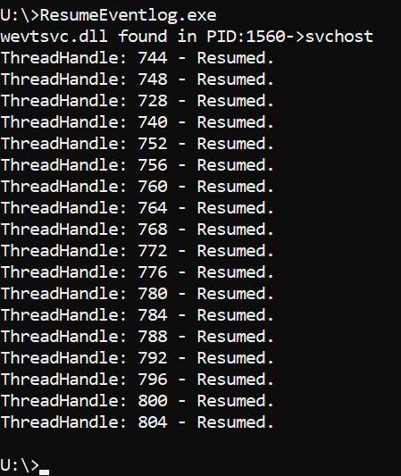

# ResumeEventlog

POC: Restores suspended Eventlog process threads

So, someone created an attack tool to freeze (suspend) the threads in the host process running Eventlog to evade detection. So, i wrote this to restore it to working order. In theory, it is a really bad thing to suspend and resume threads because it can screw up things, but in general it doesn't and you can just restore it, most threads for windows programs are actually in .Wait state, so in reality there is a very small chance of that happening. Regardless, to reduce the likelyhood of problems, you are supposed to restore threads in reverse order, but this is a Proof of concept code so - just for show.

Compiles as a Console application in Visual Studio 2019, should work with older versions as well.

Usage: No parameters, just fire it up and it finds the process hosting eventlog (wevtsvc.dll), it enumerates it's threads and restores (resumes) them to working condition.

